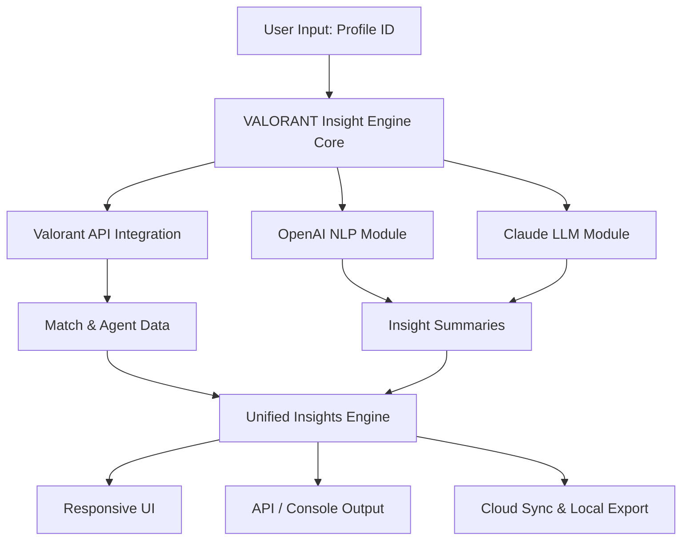

# VALORANT Insight Engine 🎮

Valorant Insight Engine is an innovative, open-source intelligence suite designed to empower you with in-depth analytics, real-time data integration, and AI-driven recommendations for the Valorant gaming ecosystem. Enable seamless Valorant API connectivity, turbocharged by both OpenAI and Claude APIs, in a toolkit crafted for developers, esports analysts, and passionate players wanting insightful Valorant profile enrichment.

---
## Table of Contents

- [🏁 Quick Download](#-quick-download)
- [✨ Features](#-features)
- [🌐 Live Example Profile Configuration](#-live-example-profile-configuration)
- [🖥️ Example: Console Invocation](#️-example-console-invocation)
- [🧭 Architecture Map (Mermaid)](#-architecture-map-mermaid)
- [💻 OS Compatibility Table](#-os-compatibility-table)
- [🤖 AI Integrations (OpenAI & Claude)](#-ai-integrations-openai--claude)
- [🌟 Why Choose VALORANT Insight Engine?](#-why-choose-valorant-insight-engine)
- [📝 Disclaimer](#-disclaimer)
- [©️ License](#️-license)
- [🏁 Quick Download (Bottom)](#-quick-download-bottom)

---
## 🏁 Quick Download

Get started by downloading the latest release:

---

## ✨ Features

Welcome to the next evolution of Valorant API tools – where the line between analysis and art blurs.

- **Deep Valorant API Data Extraction**: Unlock match histories, agent trends, and advanced stats.
- **Insight Profiles**: Generate and share player insight profiles with crowd-pleasing visuals.
- **Lightning-fast Analytics**: Real-time match parsing and report generation.
- **OpenAI & Claude Enhanced Metrics**: NLP-powered summaries, tactical suggestions, and agent meta reports.
- **Responsive Cross-Platform UI**: Impeccable UX on desktop, mobile, and tablet.
- **Multilingual Support**: Automatic translation for global competitive advantage (supports 15+ languages).
- **24/7 Community Support Genie**: Always-on, real-time support interface for your every analytical inquiry.
- **Modular Plugin System**: Plug and play—extend or customize as you wish.
- **Cloud Sync & Local Export**: Store analysis securely or offline as you prefer.

SEO keywords: Valorant analytics, Valorant profile tool, API integration, match history, esports intelligence, AI-driven gaming insights.

---

## 🌐 Live Example Profile Configuration

Configure with ease! A sample profile config showcasing multilingual, cloud-enabled insights:

{
  "profile_id": "agent-omen-primed",
  "language": "es-ES",
  "display_theme": "midnight-violet",
  "api_keys": {
    "valorant": "PASTE_YOUR_VALORANT_API_KEY_HERE",
    "openai": "OPENAI-KEY-GOES-HERE",
    "claude": "CLAUDE-KEY-GOES-HERE"
  },
  "cloud_sync": true,
  "report_format": "dynamic_pdf"
}

---

## 🖥️ Example: Console Invocation

Unveil match magic from your terminal, cloud server, or automated workflow:

valie analyze-profile --profile agent-omen-primed --export pdf --ai-suggest --lang en-US

Command breakdown:
- `analyze-profile`: Main analysis entrypoint
- `--export pdf`: Choose from pdf, md, or json
- `--ai-suggest`: Pipe all findings through AI summarizers
- `--lang`: Set output language

---

## 🧭 Architecture Map (Mermaid)

---

## 💻 OS Compatibility Table

| 🖥️ Windows | 🍏 macOS | 🐧 Linux | 📱 Android | 🍎 iOS |
|:----------:|:--------:|:--------:|:----------:|:------:|
| ✅ 10/11/12| ✅ 10.15+ | ✅ Ubuntu 20.04+ | ✅* (Web App) | ✅* (Web App) |

_Note: Native app support for Windows/macOS/Linux. Web dashboard for Android/iOS._

---

## 🤖 AI Integrations (OpenAI & Claude)

Supercharge your analysis with two AI titans:

- **OpenAI Integration**: Suggests agent picks, summarizes your week, predicts behavioral trends, and redacts sensitive info.
- **Claude (Anthropic) API**: Offers match-specific advice, forecasts team dynamics, and generates role insights.

Pairing both LLMs, you can even dual-feed a single match report for double-AI consensus!

---

## 🌟 Why Choose VALORANT Insight Engine?

Because precision matters, every second counts, and being ahead is everything. Whether you're gearing up for your regional finals or wanting to dissect your latest clutch, VALORANT Insight Engine is more than just an API connector—it's your tactical co-pilot in the world of competitive gaming.

Unique value pillars:

- **Insightful, not just Informative**: AI turns raw data into actionable wisdom.
- **Always Growing**: Modular structure means easy expansion as Valorant evolves.
- **Truly Inclusive**: Built-in language versatility and universal platform support.
- **Support Genie**: Our round-the-clock community QA leverages AI to answer your integration questions faster than a Phoenix ult.

---

## 📝 Disclaimer

VALORANT Insight Engine is an independent, open-source creation and is not affiliated with, endorsed by, or supported by Valorant or its parent companies. Usage is at the discretion and responsibility of the user. Always comply with Valorant’s terms of service and community guidelines.

---

## ©️ License

MIT License – Open collaboration and growth are at the core of our philosophy.

[View the full MIT License.](https://opensource.org/licenses/MIT)

---
## 🏁 Quick Download (Bottom)

When strategy meets science, you need the right instrument. Download now:

---
Let the data guide your aim – unleash your competitive edge with VALORANT Insight Engine, 2026.